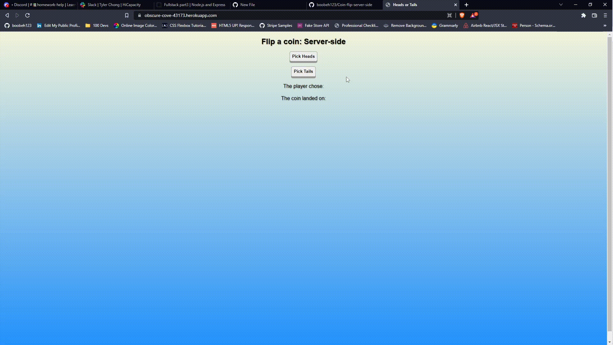

# [Coin-flip-server-side](https://github.com/boobeh123/Coin-flip-server-side)

## Description
A web application that performs a coin flip. The randomization happens on the server-side and not the browser/client-side. 
I built this project to gain more practice with Node.JS & Heroku deployment.

Edit: (new deployment)

The project is deployed here: https://mysterious-toad-beret.cyclic.app/

(previous deployment, heroku no longer free)

~~The project is deployed here: https://obscure-cove-43173.herokuapp.com/~~

## Demo

## Features
* Randomization happens on server-side.
* Displays winning conditions, player choice, & game state.
* Multiple/Back-to-back games allowed.

## Optimizations
* I would like to add an image of a coin displaying the game state.

## Technologies

